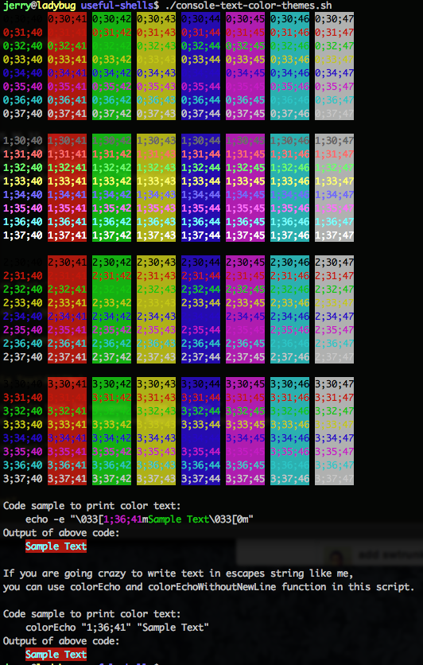

:snail: `Shell`相关脚本
====================================

<!-- START doctoc generated TOC please keep comment here to allow auto update -->
<!-- DON'T EDIT THIS SECTION, INSTEAD RE-RUN doctoc TO UPDATE -->


- [`Shell`使用加强](#shell%E4%BD%BF%E7%94%A8%E5%8A%A0%E5%BC%BA)
    - [:beer: c](#beer-c)
        - [示例](#%E7%A4%BA%E4%BE%8B)
        - [参考资料](#%E5%8F%82%E8%80%83%E8%B5%84%E6%96%99)
    - [:beer: colines](#beer-colines)
        - [示例](#%E7%A4%BA%E4%BE%8B-1)
    - [:beer: a2l](#beer-a2l)
        - [示例](#%E7%A4%BA%E4%BE%8B-2)
    - [:beer: ap and rp](#beer-ap-and-rp)
        - [示例](#%E7%A4%BA%E4%BE%8B-3)
    - [:beer: xpl and xpf](#beer-xpl-and-xpf)
        - [用法](#%E7%94%A8%E6%B3%95)
        - [示例](#%E7%A4%BA%E4%BE%8B-4)
        - [贡献者](#%E8%B4%A1%E7%8C%AE%E8%80%85)
    - [:beer: tcp-connection-state-counter.sh](#beer-tcp-connection-state-countersh)
        - [用法](#%E7%94%A8%E6%B3%95-1)
        - [示例](#%E7%A4%BA%E4%BE%8B-5)
- [`Shell`开发/测试加强](#shell%E5%BC%80%E5%8F%91%E6%B5%8B%E8%AF%95%E5%8A%A0%E5%BC%BA)
    - [:beer: echo-args.sh](#beer-echo-argssh)
        - [示例](#%E7%A4%BA%E4%BE%8B-6)
        - [使用方式](#%E4%BD%BF%E7%94%A8%E6%96%B9%E5%BC%8F)
    - [:beer: console-text-color-themes.sh](#beer-console-text-color-themessh)
        - [贡献者](#%E8%B4%A1%E7%8C%AE%E8%80%85-1)
        - [参考资料](#%E5%8F%82%E8%80%83%E8%B5%84%E6%96%99-1)
    - [:beer: parseOpts.sh](#beer-parseoptssh)
        - [用法](#%E7%94%A8%E6%B3%95-2)
        - [示例](#%E7%A4%BA%E4%BE%8B-7)
        - [兼容性](#%E5%85%BC%E5%AE%B9%E6%80%A7)
        - [贡献者](#%E8%B4%A1%E7%8C%AE%E8%80%85-2)

<!-- END doctoc generated TOC please keep comment here to allow auto update -->

`Shell`使用加强
====================================

:beer: [c](../c)
----------------------

原样命令行输出，并拷贝标准输出到系统剪贴板，省去`CTRL+C`，`CTRL+V`操作。支持`Linux`、`Mac`、`Windows`（`cygwin`、`MSSYS`）。

命令名`c`意思是`Copy`，因为这个命令我平时非常常用，所以使用一个字符的命令名，方便键入。

更多说明参见[拷贝复制命令行输出放在系统剪贴板上](http://oldratlee.com/post/2012-12-23/command-output-to-clip)。

### 示例

有3种使用风格，根据需要或是你的偏好选取。

```bash
# 1. 前缀方式，后面跟上要运行的命令
$ c pwd
/Users/jerry
$ c echo -e 'a\nb'
a
b
# 这种使用方式，后面跟的命令不能是别名（alias），对于别名可以用下面的使用方式。

# 2. 后缀方式，管道
$ echo -e 'a\nb' | nl | c
1   a
2   b
# gb是oh-my-zsh的别名，列出git的分支，需要后缀的方式的使用。
$ gb | c

# 3. 从标准输入读取内容。拷贝文件内容时这种方式最直接。
$ c < id_rsa.pub
ssh-rsa AAAAB3NzaC1yc2EAAAABIwAAAQEAz+ETZEgoLeIiC0rjWewdDs0sbo8c...== a@b.com
```

### 参考资料

[拷贝复制命令行输出放在系统剪贴板上](http://oldratlee.com/post/2012-12-23/command-output-to-clip)，给出了不同系统可用命令。

:beer: [colines](../colines)
----------------------

彩色`cat`出文件行，方便人眼区分不同的行。

命令名`colines`意思是`COLorful LINES`。

### 示例

```bash
$ echo a | colines
a
$ echo -e 'a\nb' | colines
a
b
$ echo -e 'a\nb' | nl | colines
1   a
2   b
$ colines file1 file2.txt
================================================================================
file1
================================================================================
file1 line1
file1 line2
================================================================================
file2.txt
================================================================================
file2 line1
file2 line2
```

注：上面显示中，没有彩色，在控制台上运行可以看出彩色效果。

:beer: [a2l](../a2l)
----------------------

按行彩色输出参数，方便人眼查看。

命令名`a2l`意思是`Arguments to(2) Lines`。

### 示例

```bash
$ a2l *.java
A.java
B.java
...

# zsh支持 **/* 跨目录glob，可以方便搜索，但是输出内容是空格分隔的不方便查看。
# 把参数按行输出方便查看 或是 grep
$ a2l **/*.sh
swtrunk.sh
tcp-connection-state-counter.sh
test-cases/parseOpts-test.sh
test-cases/self-installer.sh
...
```

注：上面显示中，没有彩色，在控制台上运行可以看出彩色效果。

:beer: [ap](../ap) and [rp](../rp)
----------------------

批量转换文件路径为绝对路径/相对路径，会自动跟踪链接并规范化路径。

命令名`ap`意思是`Absolute Path`，`rp`是`Relative Path`。

### 示例

```bash
# ap缺省打印当前路径的绝对路径
$ ap
/home/admin/useful-scripts/test
$ ap ..
/home/admin/useful-scripts
# 支持多个参数
$ ap .. ../.. /etc /etc/../etc
/home/admin/useful-scripts
/home/admin
/etc
/etc

# rp当一个参数时，打印相对于当前路径的相对路径
$ rp /home
../..
# 多于一个参数时，打印相对于最后一个参数的相对路径
$ rp /home /etc/../etc /home/admin
..
../../etc
```

:beer: [xpl](../xpl) and [xpf](../xpf)
----------------------

在命令行中快速完成 在文件浏览器中 打开/选中 指定的文件或文件夹的操作。

* `xpl`：在文件浏览器中打开指定的文件或文件夹。  
\# `xpl`是`explorer`的缩写。
* `xpf`: 在文件浏览器中打开指定的文件或文件夹，并选中。   
\# `xpf`是`explorer and select file`的缩写。

### 用法

```bash
xpl
# 缺省打开当前目录
xpl <文件或是目录>...
# 打开多个文件或目录

xpf
# 缺省打开当前目录
xpf <文件或是目录>...
# 打开多个文件或目录
```

### 示例

```bash
xpl /path/to/dir
xpl /path/to/foo.txt
xpl /path/to/dir1 /path/to/foo1.txt
xpf /path/to/foo1.txt
xpf /path/to/dir1 /path/to/foo1.txt
```

### 贡献者

[Linhua Tan](https://github.com/toolchainX)修复Linux的选定Bug。

:beer: [tcp-connection-state-counter.sh](../tcp-connection-state-counter.sh)
----------------------

统计各个`TCP`连接状态的个数。

像`Nginx`、`Apache`的机器上需要查看，`TCP`连接的个数，以判定

- 连接数、负荷
- 是否有攻击，查看`SYN_RECV`数（`SYN`攻击）
- `TIME_WAIT`数，太多会导致`TCP: time wait bucket table overflow`。

### 用法

```bash
tcp-connection-state-counter.sh
```

### 示例

```bash
$ tcp-connection-state-counter.sh
ESTABLISHED  290
TIME_WAIT    212
SYN_SENT     17
```

`Shell`开发/测试加强
====================================

:beer: [echo-args.sh](../echo-args.sh)
----------------------

在编写脚本时，常常要确认输入参数是否是期望的：参数个数，参数值（可能包含有人眼不容易发现的空格问题）。

这个脚本输出脚本收到的参数。在控制台运行时，把参数值括起的括号显示成 **红色**，方便人眼查看。

### 示例

```bash
$ ./echo-args.sh 1 "  2 foo  " "3        3"
0/3: [./echo-args.sh]
1/3: [1]
2/3: [  2 foo  ]
3/3: [3        3]
```

### 使用方式

需要查看某个脚本（实际上也可以是其它的可执行程序）输出参数时，可以这么做：

* 把要查看脚本重命名。
* 建一个`echo-args.sh`脚本的符号链接到要查看参数的脚本的位置，名字和查看脚本一样。

这样可以不改其它的程序，查看到输入参数的信息。

:beer: [console-text-color-themes.sh](../console-text-color-themes.sh)
----------------------

显示`Terminator`的全部文字彩色组合的效果及其打印方式。

脚本中，也给出了`colorEcho`和`colorEchoWithoutNewLine`函数更方便输出彩色文本，用法：

```bash
colorEcho <颜色样式> <要输出的文本>...
colorEchoWithoutNewLine  <颜色样式> <要输出的文本>...
```

```bash
# 输出红色文本
colorEcho "0;31;40" "Hello world!"
# 输出黄色带下划线的文本
colorEchoWithoutNewLine "4;33;40" "Hello world!" "Hello Hell!"
```

`console-text-color-themes.sh`的运行效果图如下：   


### 贡献者

[姜太公](https://github.com/jzwlqx)提供循环输出彩色组合的脚本。

### 参考资料

- [utensil](https://github.com/utensil)的[在Bash下输出彩色的文本](http://utensil.github.io/tech/2007/09/10/colorful-bash.html)，这是篇很有信息量很钻研的文章！

:beer: [parseOpts.sh](../parseOpts.sh)
----------------------

提供命令行选项解析函数`parseOpts`，以加强支持选项的值有多个值（即数组）。  
\# 自己写一个命令行选项解析函数，是因为[`bash`](http://linux.die.net/man/1/bash)的`buildin`命令[`getopts`](http://linux.die.net/man/1/getopts)和加强版本命令[`getopt`](http://linux.die.net/man/1/getopt)都不支持数组的值。

指定选项的多个值（即数组）的风格模仿[`find`](http://linux.die.net/man/1/find)命令的`-exec`选项：

```bash
$ find . -name \*.txt -exec echo "find file: " {} \;
find file: foo.txt
find file: bar.txt
...
```

### 用法

`parseOpts`函数的第一个参数是要解析的选项说明，后面跟实际要解析的输入参数。

选项说明可以长选项和短选项，用逗号分隔，如`a,a-long`。不同选项的说明间用竖号分隔，如`a,a-long|b,b-long:`。

选项说明最后可以有选项类型说明：

- `-`： 无参数的选项。即有选项则把值设置成`true`。这是 ***缺省*** 的类型。
- `:`： 有参数的选项，值只有一个。
- `+`： 有多个参数值的选项。值列表要以`;`表示结束。   
注意，`;`是`Bash`的元字符（用于一行中多个命令分隔），所以加上转义写成`\;`（当然也可以按你的喜好写成`";"`或`';'`）。

实际要解析的输入参数往往是你的脚本参数，这样`parseOpts`函数调用一般是：

```bash
parseOpts "a,a-long|b,b-long:|c,c-long+" "$@"
# "$@" 即是回放你的脚本参数
```

通过约定的全局变量来获取选项和参数：

* 选项名为`a`，通过全局变量`_OPT_VALUE_a`来获取选项的值。
* 选项名为`a-long`，通过全局变量`_OPT_VALUE_a_long`来获取选项的值。  
即，把选项名的`-`转`_`，再加上前缀`_OPT_VALUE_`对应的全局变量来获得选项值。
* 除了选项剩下的参数，通过全局变量`_OPT_ARGS`来获取。

按照惯例，输入参数中如果有`--`表示之后参数中不再有选项，即之后都是参数。

### 示例

```bash
# 导入parseOpts.sh
source /path/to/parseOpts.sh

parseOpts "a,a-long|b,b-long:|c,c-long+" -a -b bv --c-long c.sh -p pv -q qv arg1 \; aa bb cc
# 可以通过下面全局变量来获得解析的参数值：
#    _OPT_VALUE_a = true
#    _OPT_VALUE_a_long = true
#    _OPT_VALUE_b = bv
#    _OPT_VALUE_b_long = bv
#    _OPT_VALUE_c = (c.sh -p pv -q qv arg1) ，数组类型
#    _OPT_VALUE_c_long = (c.sh -p pv -q qv arg1) ，数组类型
#    _OPT_ARGS = (aa bb cc) ，数组类型
```

`--`的使用效果示例：

```bash
# 导入parseOpts.sh
source /path/to/parseOpts.sh

parseOpts "a,a-long|b,b-long:|c,c-long+" -a -b bv -- --c-long c.sh -p pv -q qv arg1 \; aa bb cc
# 可以通过下面全局变量来获得解析的参数值：
#    _OPT_VALUE_a = true
#    _OPT_VALUE_a_long = true
#    _OPT_VALUE_b = bv
#    _OPT_VALUE_b_long = bv
#    _OPT_VALUE_c 没有设置过
#    _OPT_VALUE_c_long 没有设置过
#    _OPT_ARGS = (--c-long c.sh -p pv -q qv arg1 ';' aa bb cc) ，数组类型
```

### 兼容性

这个脚本比较复杂，测试过的环境有：

1. `bash --version`  
`GNU bash, version 4.1.5(1)-release (x86_64-pc-linux-gnu)`  
`uname -a`  
`Linux foo-host 2.6.32-41-generic #94-Ubuntu SMP Fri Jul 6 18:00:34 UTC 2012 x86_64 GNU/Linux`
1. `bash --version`  
`GNU bash, version 3.2.53(1)-release (x86_64-apple-darwin14)`  
`uname -a`   
`Darwin foo-host 14.0.0 Darwin Kernel Version 14.0.0: Fri Sep 19 00:26:44 PDT 2014; root:xnu-2782.1.97~2/RELEASE_X86_64 x86_64 i386 MacBookPro10,1 Darwin`
1. `bash --version`  
`GNU bash, version 3.00.15(1)-release (i386-redhat-linux-gnu)`  
`uname -a`   
`Linux foo-host 2.6.9-103.ELxenU #1 SMP Wed Mar 14 16:31:15 CST 2012 i686 i686 i386 GNU/Linux`

### 贡献者

[Khotyn Huang](https://github.com/khotyn)指出`bash` `3.0`下使用有问题，并提供`bash` `3.0`的测试机器。

