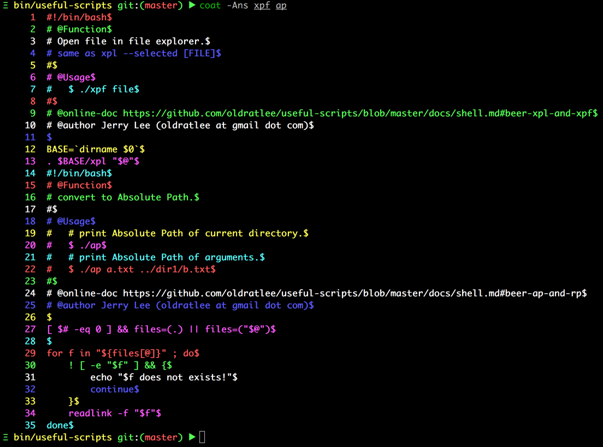

🐌 `Shell`相关脚本
====================================

<!-- START doctoc generated TOC please keep comment here to allow auto update -->
<!-- DON'T EDIT THIS SECTION, INSTEAD RE-RUN doctoc TO UPDATE -->


- [`Shell`使用加强](#shell%E4%BD%BF%E7%94%A8%E5%8A%A0%E5%BC%BA)
    - [🍺 c](#-c)
        - [用法/示例](#%E7%94%A8%E6%B3%95%E7%A4%BA%E4%BE%8B)
        - [参考资料](#%E5%8F%82%E8%80%83%E8%B5%84%E6%96%99)
    - [🍺 coat](#-coat)
        - [示例](#%E7%A4%BA%E4%BE%8B)
    - [🍺 a2l](#-a2l)
        - [示例](#%E7%A4%BA%E4%BE%8B-1)
    - [🍺 uq](#-uq)
        - [示例](#%E7%A4%BA%E4%BE%8B-2)
    - [🍺 ap and rp](#-ap-and-rp)
        - [示例](#%E7%A4%BA%E4%BE%8B-3)
    - [🍺 tcp-connection-state-counter](#-tcp-connection-state-counter)
        - [用法](#%E7%94%A8%E6%B3%95)
        - [示例](#%E7%A4%BA%E4%BE%8B-4)
        - [贡献者](#%E8%B4%A1%E7%8C%AE%E8%80%85)
    - [🍺 xpl and xpf](#-xpl-and-xpf)
        - [用法](#%E7%94%A8%E6%B3%95-1)
        - [示例](#%E7%A4%BA%E4%BE%8B-5)
        - [贡献者](#%E8%B4%A1%E7%8C%AE%E8%80%85-1)
- [`Shell`开发/测试加强](#shell%E5%BC%80%E5%8F%91%E6%B5%8B%E8%AF%95%E5%8A%A0%E5%BC%BA)
    - [🍺 echo-args](#-echo-args)
        - [示例](#%E7%A4%BA%E4%BE%8B-6)
        - [使用方式](#%E4%BD%BF%E7%94%A8%E6%96%B9%E5%BC%8F)
    - [🍺 console-text-color-themes.sh](#-console-text-color-themessh)
        - [用法](#%E7%94%A8%E6%B3%95-2)
        - [示例](#%E7%A4%BA%E4%BE%8B-7)
        - [运行效果](#%E8%BF%90%E8%A1%8C%E6%95%88%E6%9E%9C)
        - [贡献者](#%E8%B4%A1%E7%8C%AE%E8%80%85-2)
        - [参考资料](#%E5%8F%82%E8%80%83%E8%B5%84%E6%96%99-1)
    - [🍺 parseOpts.sh](#-parseoptssh)
        - [用法](#%E7%94%A8%E6%B3%95-3)
        - [示例](#%E7%A4%BA%E4%BE%8B-8)
        - [兼容性](#%E5%85%BC%E5%AE%B9%E6%80%A7)
        - [贡献者](#%E8%B4%A1%E7%8C%AE%E8%80%85-3)

<!-- END doctoc generated TOC please keep comment here to allow auto update -->

`Shell`使用加强
====================================

🍺 [c](../bin/c)
----------------------

原样命令行输出，并拷贝标准输出到系统剪贴板，省去`CTRL+C`操作，优化命令行与其它应用之间的操作流。  
支持`Linux`、`Mac`、`Windows`（`cygwin`、`MSSYS`）。

命令名`c`意思是`Copy`，因为这个命令我平时非常常用，所以使用一个字符的命令名，方便键入。

更多说明参见[拷贝复制命令行输出放在系统剪贴板上](http://oldratlee.com/post/2012-12-23/command-output-to-clip)。

### 用法/示例

有3种使用风格，根据需要或是你的偏好选取。

```bash
############################################################
# 1. 前缀方式，后面跟上要运行的命令
############################################################
$ c pwd
/Users/jerry
$ c echo -e 'a\nb'
a
b
# 这种使用方式，后面跟的命令不能是别名（alias），对于别名可以用下面的使用方式。

############################################################
# 2. 后缀方式，管道
############################################################
$ echo -e 'a\nb' | nl | c
1   a
2   b
# gb是oh-my-zsh的别名，列出git的分支，需要后缀的方式的使用。
$ gb | c

############################################################
# 3. 从标准输入读取内容。拷贝文件内容时这种方式最直接。
############################################################
$ c < ~/.ssh/id_rsa.pub
ssh-rsa EAAAABIwAAAQEAz+ETZEgoLeIiC0rjWewdDs0sbo8c...== a@b.com

############################################################
# -q选项：拷贝但不输出。
# 当输出内容比较多、又不关心输出内容和命令执行进展时，可以使用这个选项。
############################################################
$ c -q < ~/.ssh/id_rsa.pub

# 帮助信息
$ c --help
Usage: c [OPTION]... [command [command_args ...]]
Run command and put output to system clipper.
If no command is specified, read from stdin(pipe).

Example:
  c echo 'hello world!'
  c grep -i 'hello world' menu.h main.c
  set | c
  c -q < ~/.ssh/id_rsa.pub

Options:
  -k, --keep-eol  do not trim new line at end of file
  -q, --quiet     suppress all normal output, default is false
  -h, --help      display this help and exit
```

### 参考资料

- [拷贝复制命令行输出放在系统剪贴板上](http://oldratlee.com/post/2012-12-23/command-output-to-clip)，给出了不同系统可用命令。
- 关于文本文件最后的换行，参见[Why should text files end with a newline?](https://stackoverflow.com/questions/729692)

🍺 [coat](../bin/coat)
----------------------

彩色`cat`出文件行，方便人眼区分不同的行。  
支持`Linux`、`Mac`、`Windows`（`cygwin`、`MSSYS`）。

命令支持选项、功能和使用方式与[`cat`命令](https://linux.die.net/man/1/cat)完全一样（实际上读流操作在实现上全部代理给`cat`命令）。

命令名`coat`意思是`COlorful cAT`；当然单词`coat`的意思是外套，彩色输入行就像件漂亮的外套～ 😆

### 示例

```bash
$ echo Hello world | coat
Hello world
$ echo -e 'Hello\nWorld' | coat
Hello
World
$ echo -e 'Hello\nWorld' | nl | coat
     1	Hello
     2	World
$ coat file1 file2.txt
line1 of file1
line2 of file1
...
line1 of file2
line2 of file2
...

# 帮助信息
#   可以看到本人机器上实现代理的`cat`命令是GNU的实现。
$ coat --help
Usage: cat [OPTION]... [FILE]...
Concatenate FILE(s) to standard output.

With no FILE, or when FILE is -, read standard input.

  -A, --show-all           equivalent to -vET
  -b, --number-nonblank    number nonempty output lines, overrides -n
  -e                       equivalent to -vE
  -E, --show-ends          display $ at end of each line
  -n, --number             number all output lines
  -s, --squeeze-blank      suppress repeated empty output lines
  -t                       equivalent to -vT
  -T, --show-tabs          display TAB characters as ^I
  -u                       (ignored)
  -v, --show-nonprinting   use ^ and M- notation, except for LFD and TAB
      --help     display this help and exit
      --version  output version information and exit

Examples:
  cat f - g  Output f's contents, then standard input, then g's contents.
  cat        Copy standard input to standard output.

GNU coreutils online help: <http://www.gnu.org/software/coreutils/>
Full documentation at: <http://www.gnu.org/software/coreutils/cat>
or available locally via: info '(coreutils) cat invocation'
```

注：上面示例中，没有彩色；在控制台上运行可以看出彩色效果，如下：  


🍺 [a2l](../bin/a2l)
----------------------

按行彩色输出参数，方便人眼查看。  
支持`Linux`、`Mac`、`Windows`（`cygwin`、`MSSYS`）。

命令名`a2l`意思是`Arguments to(2) Lines`。

### 示例

```bash
$ a2l *.java
A.java
B.java
...

# zsh支持 **/* 跨目录glob，可以方便搜索，但是输出内容是空格分隔的不方便查看。
# 把参数按行输出方便查看 或是 grep
$ a2l **/*.sh
lib/console-text-color-themes.sh
test-cases/parseOpts-test.sh
test-cases/self-installer.sh
...
```

注：上面示例中，没有彩色；在控制台上运行可以看出彩色效果，和上面的`coat`命令一样。

🍺 [uq](../bin/uq)
----------------------

不重排序输入完成整个输入行的去重。相比系统的`uniq`命令加强的是可以跨行去重，不需要排序输入。  
使用方式与支持的选项 模仿系统的`uniq`命令。支持`Linux`、`Mac`、`Windows`（`cygwin`、`MSSYS`）。

> ‼️ **_注意_**： 去重过程会在内存持有整个输入（因为全局去重）！  
> 对于输入大小较大的场景（如输入有几百M甚至几G），需谨慎使用；往往需要结合业务场景开发对应的优化实现。
>
> 虽然平时的大部分场景输入量非常有限（如几M），一个简单没有充分优化的实现是快速够用的。

因为`uniq`命令完成是相邻行的去重，需要通过或是组合`sort`命令来完成整输入的去重，会有下面的问题：

```bash
# 示例输入
$ cat foo.txt
c
c
b
a
a
c
c

$ uniq foo.txt
c
b
a
c
# c输出了2次，原因是第二个c与第一个c不是相邻的重复行

# 可以通过 sort -u 来完成整个输入去重，但这样操作，顺序与输入行不一致
$ sort -u foo.txt
a
b
c
# 输入行重排序了！

# 另外一个经典的用法 sort 与 uniq -c，输出重复次数
$ sort foo.txt | uniq -c
      2 a
      1 b
      4 c
# 输入行重排序了！
```

### 示例

```bash
$ uq foo.txt # 输入是文件
$ cat foo.txt | uq # 或是 标准输入/管道
c
b
a
# 对整个输入行去重，且顺序与输入行一致（保留第一次出现的位置）

# -c 选项：输出重复次数
$ uq -c foo.txt
      4 c
      1 b
      2 a

# -d, --repeated 选项：只输出 重复行
$ uq -d foo.txt
c
a
# -u, --unique 选项：只输出 唯一行（即不重复的行）
$ uq -u foo.txt
b

# -D 选项：重复行都输出，即重复了几次就输出几次
$ uq -D -c foo.txt
      4 c
      4 c
      1 b
      2 a
      2 a
      4 c
      4 c

# 有多个文件参数时，最后一个参数 是 输出文件
$ uq in1.txt in2.txt out.txt
# 当有多个输入文件时，但要输出到控制台时，指定输出文件（最后一个文件参数）为 `-` 即可
$ uq in1.txt in2.txt -

# 帮助信息
$ uq -h
Usage: uq [OPTION]... [INPUT [OUTPUT]]
Filter lines from INPUT (or standard input), writing to OUTPUT (or standard output).
Same as `uniq` command in core utils,
but detect repeated lines that are not adjacent, no sorting required.

Example:
  # only one file, output to stdout
  uq in.txt
  # more than 1 file, last file argument is output file
  uq in.txt out.txt
  # when use - as output file, output to stdout
  uq in1.txt in2.txt -

Options:
  -c, --count           prefix lines by the number of occurrences
  -d, --repeated        only print duplicate lines, one for each group
  -D                    print all duplicate lines
                        combined with -c/-d option usually
  --all-repeated[=METHOD]  like -D, but allow separating groups
                           with an empty line;
                           METHOD={none(default),prepend,separate}
  -u, --unique          Only output unique lines
                          that are not repeated in the input
  -i, --ignore-case     ignore differences in case when comparing
  -z, --zero-terminated line delimiter is NUL, not newline

Miscellaneous:
  -h, --help            display this help and exit
```

🍺 [ap](../bin/ap) and [rp](../bin/rp)
----------------------

批量转换文件路径为绝对路径/相对路径，会自动跟踪链接并规范化路径。  
支持`Linux`、`Mac`、`Windows`（`cygwin`、`MSSYS`）。

命令名`ap`意思是`Absolute Path`，`rp`是`Relative Path`。

### 示例

```bash
# ap缺省打印当前路径的绝对路径
$ ap
/home/admin/useful-scripts/test
$ ap ..
/home/admin/useful-scripts
# 支持多个参数
$ ap .. ../.. /etc /etc/../etc
/home/admin/useful-scripts
/home/admin
/etc
/etc

# rp当一个参数时，打印相对于当前路径的相对路径
$ rp /home
../..
# 多于一个参数时，打印相对于最后一个参数的相对路径
$ rp /home /etc/../etc /home/admin
..
../../etc
```

<a id="beer-tcp-connection-state-countersh"></a>
<a id="beer-tcp-connection-state-counter"></a>

🍺 [tcp-connection-state-counter](../bin/tcp-connection-state-counter)
----------------------

统计各个`TCP`连接状态的个数。  
支持`Linux`、`Mac`、`Windows`（`cygwin`、`MSSYS`）。

像`Nginx`、`Apache`的机器上需要查看，`TCP`连接的个数，以判定

- 连接数、负荷
- 是否有攻击，查看`SYN_RECV`数（`SYN`攻击）
- `TIME_WAIT`数，太多会导致`TCP: time wait bucket table overflow`。

### 用法

```bash
tcp-connection-state-counter
```

### 示例

```bash
$ tcp-connection-state-counter
ESTABLISHED  290
TIME_WAIT    212
SYN_SENT     17
```

### 贡献者

[sunuslee](https://github.com/sunuslee)改进此脚本，增加对`MacOS`的支持。 [#56](https://github.com/oldratlee/useful-scripts/pull/56)

🍺 [xpl](../bin/xpl) and [xpf](../bin/xpf)
----------------------

在命令行中快速完成 在文件浏览器中 打开/选中 指定的文件或文件夹的操作，优化命令行与其它应用之间的操作流。  
支持`Linux`、`Mac`、`Windows`（`cygwin`、`MSSYS`）。

- `xpl`：在文件浏览器中打开指定的文件或文件夹。  
    `xpl`是`explorer`的缩写。
- `xpf`: 在文件浏览器中打开指定的文件或文件夹，并选中。  
    `xpf`是`explorer and select file`的缩写。

### 用法

```bash
xpl
# 缺省打开当前目录
xpl <文件或是目录>...
# 打开多个文件或目录

xpf
# 缺省打开当前目录
xpf <文件或是目录>...
# 打开多个文件或目录
```

### 示例

```bash
xpl /path/to/dir
xpl /path/to/foo.txt
xpl /path/to/dir1 /path/to/foo1.txt
xpf /path/to/foo1.txt
xpf /path/to/dir1 /path/to/foo1.txt
```

### 贡献者

[Linhua Tan](https://github.com/toolchainX)修复Linux的选定Bug。

`Shell`开发/测试加强
====================================

<a id="beer-echo-argssh"></a>
<a id="beer-echo-args"></a>

🍺 [echo-args](../bin/echo-args)
----------------------

在编写脚本时，常常要确认输入参数是否是期望的：参数个数，参数值（可能包含有人眼不容易发现的空格问题）。  
支持`Linux`、`Mac`、`Windows`（`cygwin`、`MSSYS`）。

这个脚本输出脚本收到的参数。在控制台运行时，把参数值括起的括号显示成 **红色**，方便人眼查看。

### 示例

```bash
$ ./echo-args 1 "  2 foo  " "3        3"
0/3: [./echo-args]
1/3: [1]
2/3: [  2 foo  ]
3/3: [3        3]
```

### 使用方式

需要查看某个脚本（实际上也可以是其它的可执行程序）输出参数时，可以这么做：

- 把要查看脚本重命名。
- 建一个`echo-args`脚本的符号链接到要查看参数的脚本的位置，名字和查看脚本一样。

这样可以不改其它的程序，查看到输入参数的信息。

🍺 [console-text-color-themes.sh](../lib/console-text-color-themes.sh)
----------------------

显示`Terminator`的全部文字彩色组合的效果及其打印方式。  
支持`Linux`、`Mac`、`Windows`（`cygwin`、`MSSYS`）。

脚本中，也给出了`colorEcho`和`colorEchoWithoutNewLine`函数更方便输出彩色文本

### 用法

```bash
colorEcho <颜色样式> <要输出的文本>...
colorEchoWithoutNewLine  <颜色样式> <要输出的文本>...
```

### 示例

```bash
source console-text-color-themes.sh

# 输出红色文本
colorEcho "0;31;40" "Hello world!"
# 输出黄色带下划线的文本
colorEchoWithoutNewLine "4;33;40" "Hello world!" "Hello Hell!"
```

### 运行效果


### 贡献者

[姜太公](https://github.com/jzwlqx)提供循环输出彩色组合的脚本。

### 参考资料

- [utensil](https://github.com/utensil)的[在Bash下输出彩色的文本](http://utensil.github.io/tech/2007/09/10/colorful-bash.html)，这是篇很有信息量很钻研的文章！

🍺 [parseOpts.sh](../lib/parseOpts.sh)
----------------------

命令行选项解析库，加强支持选项有多个值（即数组）。  
支持`Linux`、`Mac`、`Windows`（`cygwin`、`MSSYS`）。

自己写一个命令行选项解析函数，是因为[`bash`](http://linux.die.net/man/1/bash)的`buildin`命令[`getopts`](http://linux.die.net/man/1/getopts)和加强版本命令[`getopt`](http://linux.die.net/man/1/getopt)都不支持数组的值。

指定选项的多个值（即数组）的风格模仿[`find`](http://linux.die.net/man/1/find)命令的`-exec`选项：

```bash
$ find . -name \*.txt -exec echo "find file: " {} \;
find file: foo.txt
find file: bar.txt
...
```

### 用法

`parseOpts`函数的第一个参数是要解析的选项说明，后面跟实际要解析的输入参数。

选项说明可以长选项和短选项，用逗号分隔，如`a,a-long`。不同选项的说明间用竖号分隔，如`a,a-long|b,b-long:`。

选项说明最后可以有选项类型说明：

- `-`： 无参数的选项。即有选项则把值设置成`true`。这是 ***缺省*** 的类型。
- `:`： 有参数的选项，值只有一个。
- `+`： 有多个参数值的选项。值列表要以`;`表示结束。  
    注意，`;`是`Bash`的元字符（用于一行中多个命令分隔），所以加上转义写成`\;`（当然也可以按你的喜好写成`";"`或`';'`）。

实际要解析的输入参数往往是你的脚本参数，这样`parseOpts`函数调用一般是：

```bash
parseOpts "a,a-long|b,b-long:|c,c-long+" "$@"
# "$@" 即是回放你的脚本参数
```

通过约定的全局变量来获取选项和参数：

- 选项名为`a`，通过全局变量`_OPT_VALUE_a`来获取选项的值。
- 选项名为`a-long`，通过全局变量`_OPT_VALUE_a_long`来获取选项的值。  
    即，把选项名的`-`转`_`，再加上前缀`_OPT_VALUE_`对应的全局变量来获得选项值。
- 除了选项剩下的参数，通过全局变量`_OPT_ARGS`来获取。

按照惯例，输入参数中如果有`--`表示之后参数中不再有选项，即之后都是参数。

### 示例

```bash
# 导入parseOpts.sh
source /path/to/parseOpts.sh

parseOpts "a,a-long|b,b-long:|c,c-long+" -a -b bv --c-long c.sh -p pv -q qv arg1 \; aa bb cc
# 可以通过下面全局变量来获得解析的参数值：
#    _OPT_VALUE_a = true
#    _OPT_VALUE_a_long = true
#    _OPT_VALUE_b = bv
#    _OPT_VALUE_b_long = bv
#    _OPT_VALUE_c = (c.sh -p pv -q qv arg1) ，数组类型
#    _OPT_VALUE_c_long = (c.sh -p pv -q qv arg1) ，数组类型
#    _OPT_ARGS = (aa bb cc) ，数组类型
```

`--`的使用效果示例：

```bash
# 导入parseOpts.sh
source /path/to/parseOpts.sh

parseOpts "a,a-long|b,b-long:|c,c-long+" -a -b bv -- --c-long c.sh -p pv -q qv arg1 \; aa bb cc
# 可以通过下面全局变量来获得解析的参数值：
#    _OPT_VALUE_a = true
#    _OPT_VALUE_a_long = true
#    _OPT_VALUE_b = bv
#    _OPT_VALUE_b_long = bv
#    _OPT_VALUE_c 没有设置过
#    _OPT_VALUE_c_long 没有设置过
#    _OPT_ARGS = (--c-long c.sh -p pv -q qv arg1 ';' aa bb cc) ，数组类型
```

### 兼容性

这个脚本比较复杂，测试过的环境有：

1. `bash --version`  
    `GNU bash, version 4.1.5(1)-release (x86_64-pc-linux-gnu)`  
    `uname -a`  
    `Linux foo-host 2.6.32-41-generic #94-Ubuntu SMP Fri Jul 6 18:00:34 UTC 2012 x86_64 GNU/Linux`
1. `bash --version`  
    `GNU bash, version 3.2.53(1)-release (x86_64-apple-darwin14)`  
    `uname -a`  
    `Darwin foo-host 14.0.0 Darwin Kernel Version 14.0.0: Fri Sep 19 00:26:44 PDT 2014; root:xnu-2782.1.97~2/RELEASE_X86_64 x86_64 i386 MacBookPro10,1 Darwin`
1. `bash --version`  
    `GNU bash, version 3.00.15(1)-release (i386-redhat-linux-gnu)`  
    `uname -a`  
    `Linux foo-host 2.6.9-103.ELxenU #1 SMP Wed Mar 14 16:31:15 CST 2012 i686 i686 i386 GNU/Linux`

### 贡献者

[Khotyn Huang](https://github.com/khotyn)指出`bash` `3.0`下使用有问题，并提供`bash` `3.0`的测试机器。

